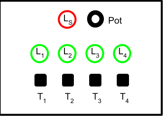
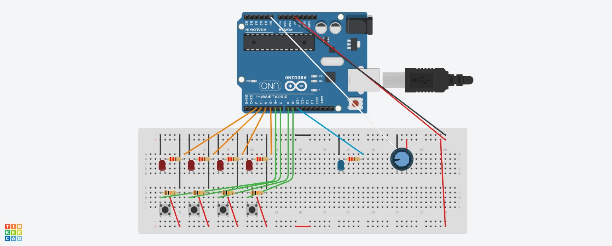
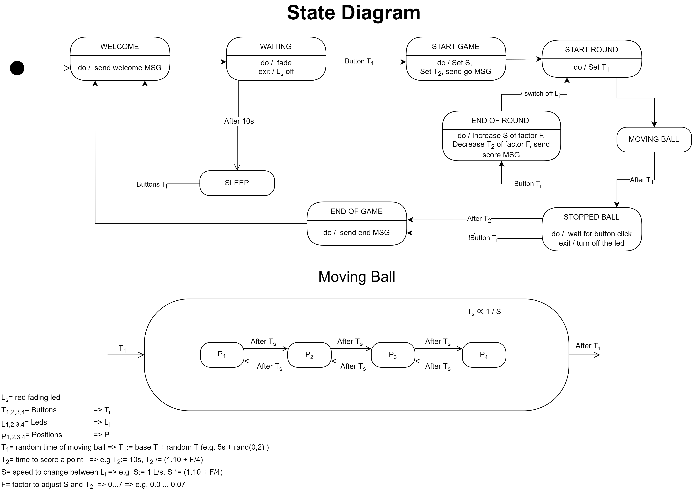

# Assignment 1
## Description

 
The game board is based on 4 green leds L1, L2, L3, L4 and red led LS, four tactile buttons T1, T2, T3, T4 and a potentiometer Pot, displaced in the following layout:
The green leds represent four different positions in which a virtual ball (the led ball) is positioned. A led on means that the ball is in that position. During the game, the ball moves repeatedly in from L1 to L4 and back, with a speed S for some random time T1. After T1, the ball stops in some position P and the user playing the game has T2 time to press the button in position P.  If the player presses the button within time T2, it gets one point augmenting the score, and the game goes on – augmenting the speed S  and reducing the time T2 of a factor F. If the player does not press the button on time, the game is over.

---
## Game Details
In the initial state, all green leds are off but led LS that pulses (fading in and out), waiting for some player to start the game. On the serial line, it must be sent the message “Welcome to the Catch the Bouncing Led Ball Game. Press Key T1 to Start”. 

If/when the button T1 is pressed the game starts.  If the T1 button is not pressed within 10 seconds, the system must go in deep sleeping. The system can be awoken back  by pressing any button. Once awoken, the system goes in the initial state and the led Ls starts pulsing again. 
 
When the game starts, all leds are switched off and a “Go!” message is sent on the serial line. An initial score is set to zero.

During the game:
the ball moves repeatedly in from L1 to L4 and back, with a speed S for some random time T1
After T1, the ball stops in some position P and the user playing the game has T2 time to press the button in position P 
e.g., if the ball is on the led L2, then P = 2 and the button to be pressed is T2
 If the player presses the button within time T2, then:
The score is incremented and a message "New point! Score: XXX" (where XXX is the current score) is sent on the serial line
The game goes on – augmenting the speed S and reducing the time T2 of a factor F 
If the player does not press the button on time, a message "Game Over. Final Score: XXX" (where XXX is the final score) is sent on the serial line for 10 seconds, then the game restarts from the initial state.

Before starting the game, the potentiometer Pot device can be used to set the difficulty L level  which could be a value in the range 1..8 (1 easiest, 8 most difficult). The level must affect the value of the factor F (so that the more difficult the game is, the greater the factor F must be). 

---
## Assignment
<ul>
    <li>Develop the game on the Arduino platform, implementing the embedded software in C using the Wiring framework. The game must be based on a superloop control architecture.
        <ul>
            <li>Choose concrete values for parameters in order to have the best game play.</li>
            <li>For any other aspect not specified, make the choice that you consider most appropriate.</li>
        </ul>
    </li>
    <li>The deliverable must a zipped folder assignment-01.zip including two subfolders:
        <ul>
            <li>src - including the Arduino project source code</li>
            <li>doc, including - a representation of the schema/breadboard using tools such as   TinkerCad or Fritzing or Eagle,a short video (or the link to a video on the cloud) demonstrating the system</li>
        </ul>
    </li>
</ul>

# Solutions
## Schemas

## States

---
## Video
https://github.com/zucchero-sintattico/iot2122/blob/main/assignment-1/img/video.mp4
