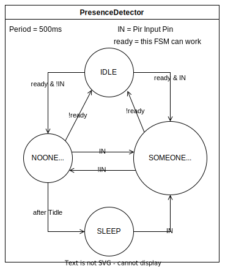
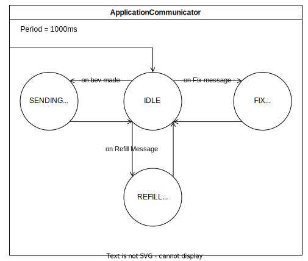

# Assignment #2 - Smart Coffee Machine

## Assignment

### Description

The system is composed of three tactile buttons Bup, Bdown, Bmake, a potentiometer Potsugar, a display D connected to the board through I2C, a pir P, a sonar S, a servo motor M and analog temperature sensor T.

The system is connected to a PC through a serial line. On the PC there is a simple application called  "Coffee Machine Manager" that interacts with the system.

The coffee machine is able to make three different kinds of products: 
- coffee
- tea
- chocolate

When refilled, the machine can make up to Nmax products for each type.  

A user interacts with the machine by means of the buttons  Bup, Bdown, and  Bmake – to select and make a product – and to Potsugar to choose the sugar level.

The making process is simulated by means of the motor M.

The machine has a power-saving modality, so that it goes to sleep if it is idle for a certain amount of time and no users are nearby.

The Coffee Machine Manager application is used to monitor and check the state of the machine, as well as to refill it when there are no more products that can be made.

  

### Detailed behaviour

- When the machine boots, it displays a welcome message (choose it) for a couple of seconds,  and initialises the number of products that can be delivered – Nmax items for each type.  After this initialisation stage, a message "Ready." is displayed on the display D.

- A user can 
  1. Select the product to make by using  Bup and Bdown
  2. Start making process by pressing  Bmake
  3. The sugar level can be tuned by using the Potsugar. 
When pressing Bup and Bdown a message reporting the name of currently selected product type is displayed on D. The message is kept for 5 seconds (if no other buttons are pressed), then the message "Ready." is displayed back.

If/when the making process starts, a proper message "making a XXX…" is displayed (XXX = "coffee", "tea", "chocolate").  The making process of a product  is simulated by means of the motor M, rotating from 0 (beginning of the process) to 180 (end of the process, product ready). The making process takes Tmaking seconds to complete. When the process has completed, a message "The XXX is ready." is displayed.

A product is available for selection only if the current number of available items is greater than zero. If no product is available, then the machine enters in a "assistance" modality – displaying a message "Assistance Required" on the display D. Then, the normal behaviour of the machine can be resumed only by  means of the Coffee Machine Manager application – doing a refill in this case.

When the product is ready, the product must be removed by the user. The product is considered removed as soon as the distance of the user as measured by the sonar S is greater than 40 cm. A distance less than 40 cm means that the product is still there and the machine has to wait for the user to take it. Nevertheless, if the user does not take the product within Ttimeout seconds, the machine goes on.  As soon as the product is removed or the timeout occurs, the motor M is reset to 0 (as fast as possible).

When the machine is an idle state for more than Tidle seconds and no user is detected (by the pir P) nearby, then the machine goes to sleep, waiting for some user to be detected

Periodically, every Tcheck seconds, the machine does an self-test – doing a complete rotation of the motor M from 0 to 180 and back (simulating some mechanic check) and checking the value of the temperature Temp measure by means of the sensor T. If the Temp value is not in the range [Tempmin, Tempmax], then the machine enters in the "assistance" modality - displaying a message "Assistance Required" on the display D. In the "assistance" modality, no products can be made. The normal behaviour of the machine can be resumed only by  the Coffee Machine Manager application.

The Coffee Machine Manager applications must provide a simple GUI (or event a textual UI, if preferred) that makes it possible to:
- show the up-to-date state of the coffee machine:
  - modality, if it is idle or working, or assistance 
  - the number of product items that are still available
  - the number of self-tests performed since the boot
- refill - by means of a "Refill" button
- recover - by means of a "Recover" button (useful in the case in which the machine has detected a problem during the self-test)

### Delivery instruction

Develop the embedded software on Arduino + PC connected through the serial line, implementing the Arduino part in C++/Wiring e the PC part in Java or in another favourite language.  The Arduino program must be designed and implemented using task-based architectures and synchronous Finite State Machines.

Some concrete values suggested for tests:

- Tmaking  = 10  seconds
- Ttimeout = 5   seconds
- Tidle    = 60  seconds
- Tcheck   = 180 seconds
- Tempmin  = 17 °C
- Tempmax  = 24 °C

For any aspect not specified, you are free to choose the approach you consider more useful or valuable.

## Solution

### Board schema

### Architecture

The system is composed by many tasks and a **cooperative scheduler** with *period* = 50ms.

Each sensor involved in the task will performe a read in order to minimize discrepancies between collected data from the enviroment and operation.

Each task which has execution constraints (e.g. a self check could not be performed during the making process) includes an IDLE state where it could wait.

A Task can not change the state of another task. In order to realize communication between them, two different approaches are adopted:
- A shared variable *AppData* to handle the general status of the machine
- A *Message Bus* where tasks can publish and read messages

### Tasks

#### Boot task

The boot task will display the boot message for Tboot time.

  

#### Beverage selector and maker tasks

These two tasks are sequentially: when a beverage is selected throught the first task, then is made by the second one.

Selector task start printing "Ready" on the display, waiting for any button pressed. During the selection with the Bup and Bdown buttons, available beverage are shown on display. At the same time, the sugar level could be selected with the potentiometer. After 5s in without change, machine the task return in ready. When Bmake is pressed, the maker task will start its work, simulating the process and then waiting for the beverage collection. If distance condition is satisfied or Ttimeout is passed, the this task finish his work and the selector is resumed. If no beverage are available, then it goes is assistance modality.

  

#### Presence task

The presence task check for the user presence using the sonar. If no one is available for a certain amount of time, will send the machine in sleep mode

  

#### Self check task

The self check task check after a certain amount of time, will perform a mechanical check using the motor. Then it checks if the temperature is in the correct range and if not, will send the machine in assistance mode, waiting for the pc app to restore the normal state

  

#### App communicator task

The app communicator task is listening to the Serial line for incoming messages. Periodically it send the machine status to the pc app

  

#### Memory task

  

### Coordination of tasks

This diagram would explain which tasks could be concurrent and which will be sequentially

  

